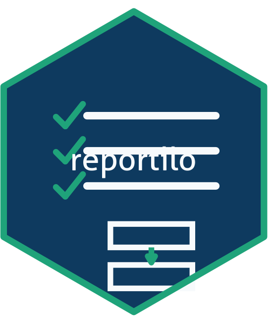

<!-- README.md is generated from README.Rmd. Please edit that file. -->

```{r, include = FALSE}
knitr::opts_chunk$set(
  collapse = TRUE,
  comment = "#>",
  fig.path = "man/figures/README-",
  out.width = "100%"
)
```

# reportilo 

<!-- badges: start -->
[](https://github.com/choxos/reportilo/actions/workflows/R-CMD-check.yaml)
[](https://lifecycle.r-lib.org/articles/stages.html#experimental)
<!-- badges: end -->

`reportilo` turns the [EQUATOR Network](https://www.equator-network.org/)
library of health research reporting guidelines into a working toolkit. Find a
guideline, fill in its reporting checklist or flow diagram, and export the
result to Word, Excel or an image.

It ships three coordinated front ends from a single source of truth:

* the **R package** (data and functions documented here),
* a bundled, modern **Shiny application** (`launch_reportilo()`), and
* a companion **browser application** at
  <https://choxos.github.io/reportilo/app/>.

## What is inside

* A searchable **catalog** of all the EQUATOR reporting guidelines.
* Fillable **checklists** for a subset of guidelines: a small hand-verified
  core (currently PRISMA 2020, CONSORT and STROBE) plus best-effort,
  automatically extracted checklists for many more, each item carrying its
  provenance and a parse-confidence score. Coverage is partial and not all
  extracted checklists are verified; `reportilo_coverage()` reports what is
  verified versus extracted, by category.
* Data-driven **flow diagram** templates: PRISMA 2020, CONSORT and STARD, plus
  observational designs (cohort, case-control and cross-sectional).
* **Risk-of-bias** traffic-light and summary plots for the common tools
  (RoB 2, ROBINS-I and more).
* An **export engine** for Word (`.docx`), Excel (`.xlsx`) and image
  (`.png` / `.svg` / `.pdf`) output.

## Installation

```{r, eval = FALSE}
# install.packages("pak")
pak::pak("choxos/reportilo")
```

## Quick start

```{r, eval = FALSE}
library(reportilo)

# 1. Find a guideline
search_guidelines("randomized trial")
guideline_info("consort")

# 2. Fill in its checklist
chk <- get_checklist("prisma-2020")
chk$response[1:3] <- c("1", "2", "2")

# 3. Export
reportilo_export(chk, "prisma-checklist.docx")

# Flow diagrams work the same way
fc <- new_flowchart("prisma_2020")
fc <- set_counts(fc, identified_db = 1200, screened = 980)
reportilo_export(fc, "prisma-flow.png")
```

Prefer to point and click?

```{r, eval = FALSE}
launch_reportilo()
```

## Data provenance

Guideline metadata is derived from the EQUATOR Network reporting guideline
library. Checklist items are extracted from the guideline source documents;
guidelines without a machine-readable checklist remain available as catalog
entries that link to their original source. Most checklists are extracted
automatically and should be verified against the source before use; only a small
core is hand-verified. See `reportilo_coverage()` for verified-versus-extracted
coverage by category, and `parse_status` for per-guideline detail.

## License

GPL-3. The reporting guidelines themselves are the work of their respective
authors and are subject to their own terms; `reportilo` links to each source.
